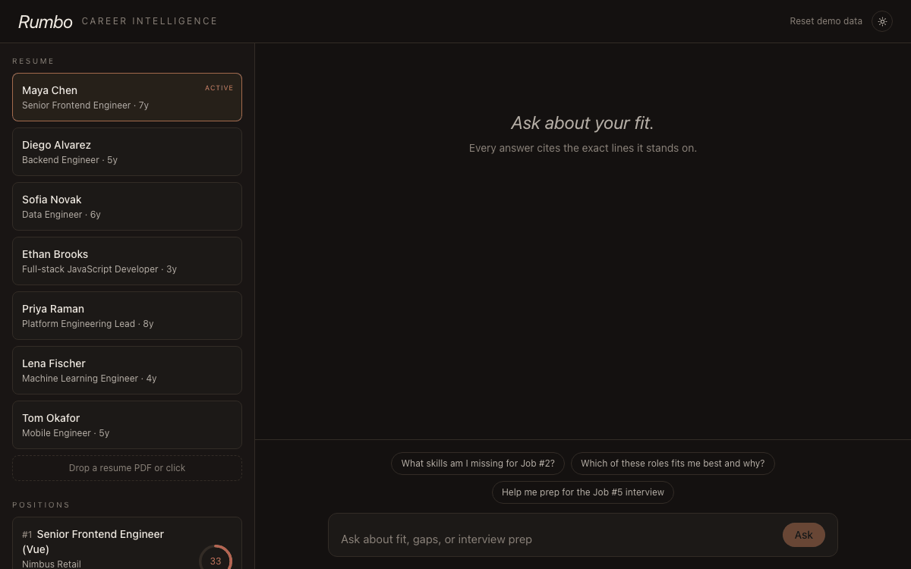
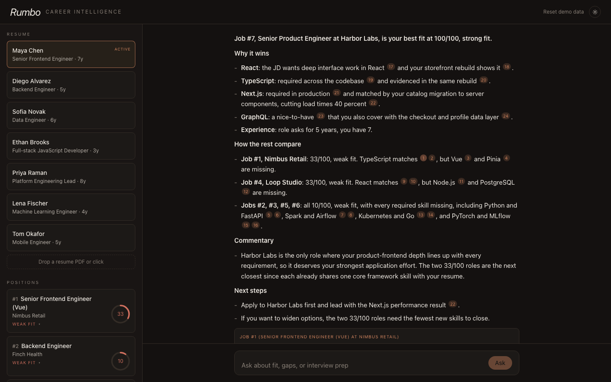
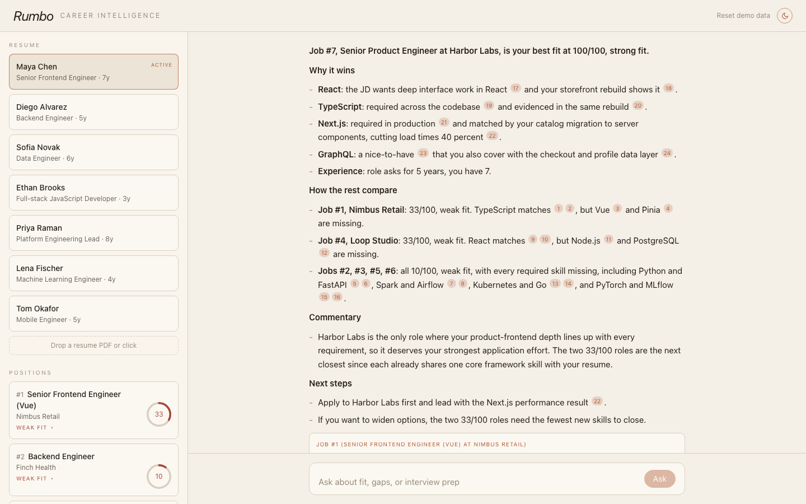
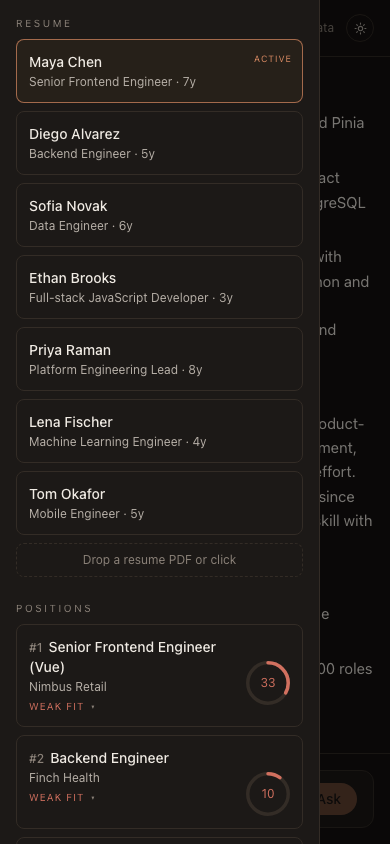
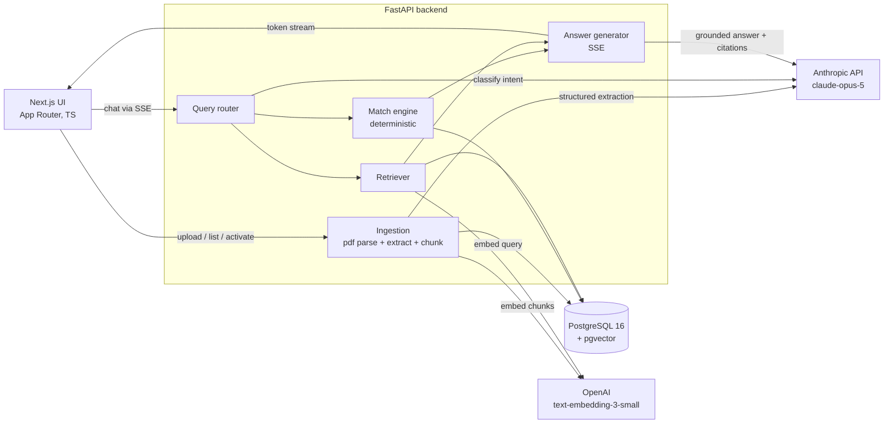
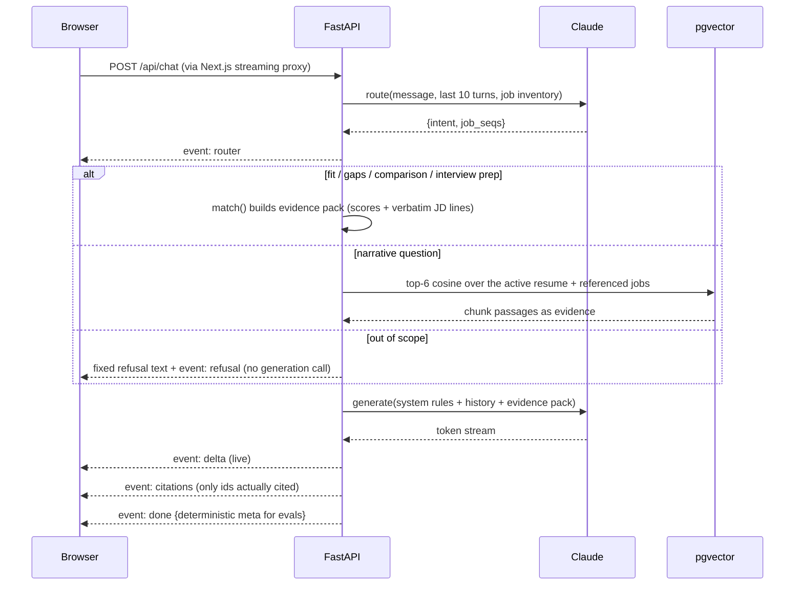

# Rumbo

[](https://github.com/bogdankf1/rumbo/actions/workflows/ci.yml)

Career intelligence over one resume and the roles you want. Upload a resume (PDF) and job descriptions (PDF or pasted text). Rumbo extracts both into structured data with Claude, scores every match deterministically, and answers questions in a streaming chat where every claim cites the exact line it stands on. Questions it cannot answer from your documents get a marked refusal instead of a confident guess.



| Dark, citations expanded | Light theme | Phone |
|---|---|---|
|  |  |  |

A screen-recorded walkthrough is in [docs/media/rumbo-demo.webm](docs/media/rumbo-demo.webm).

## Quick setup

Requirements: Docker, an Anthropic API key, an OpenAI API key (embeddings only).

```bash
cp .env.example .env        # fill in ANTHROPIC_API_KEY and OPENAI_API_KEY
docker compose up --build
```

Open http://localhost:3000 and click **Load demo data**: 7 synthetic resumes and 7 synthetic job descriptions with deliberate overlaps and gaps. Switch the active resume in the sidebar and watch every fit score recompute. All demo people and companies are invented. There is a light and dark theme toggle in the top bar, and the layout works down to phone widths.

Local development (Postgres in Docker on host port 5433, servers on the host):

```bash
make dev-db          # pgvector
make dev-backend     # FastAPI with reload on :8000 (needs uv)
make dev-frontend    # Next.js on :3000
make test            # pytest, 34 tests, no API keys needed
make eval            # 13-case deterministic eval suite (calls both APIs)
```

## Why this design

This is a two-document-type, cross-comparison problem, not a single corpus with Q&A on top. Pure embedding matching lies in this domain: "React" and "Vue" sit close together in embedding space but are different skills, and a fit score built on cosine similarity would give credit for the wrong framework. So the pipeline is hybrid:

1. **LLM structured extraction**: each document becomes typed JSON with verbatim evidence quotes, validated as substrings of the source text.
2. **Deterministic matching**: fit scores and gaps are plain set logic over canonical skill names. Reproducible, unit-tested, explainable; the LLM never touches the numbers.
3. **Embeddings only where they belong**: narrative questions retrieve chunks via pgvector; skill matching never does.

<!-- TODO(bohdan): write in your own words -->
> _TODO: my reasoning for choosing this assignment option and this hybrid design._
<!-- /TODO -->

## Architecture



How a chat question flows:



Full data model and API contract: [SPEC.md](SPEC.md). The spec was written and approved before any code; the implementation plan lives in [docs/superpowers/plans](docs/superpowers/plans).

## RAG and LLM approach

| Component | Choice | Alternatives considered | Why |
|---|---|---|---|
| LLM (extraction + routing + generation) | `claude-opus-5` | Sonnet 5; Haiku for extraction | Strongest structured extraction and grounded generation; one model keeps config simple; cost negligible at demo scale |
| Embeddings | OpenAI `text-embedding-3-small` (1536d) | Voyage, local models | Commodity component behind a one-file adapter (`services/embeddings.py`); Anthropic has no embeddings API, so single-vendor was impossible anyway |
| Vector store | pgvector in the app's Postgres | Pinecone, Chroma, Qdrant | One database for relational and vector data, zero extra ops; a dedicated store at ~100 chunks is over-engineering |
| Orchestration | Plain Python + official SDKs | LangChain, LlamaIndex | The pipeline is one router call plus one generation call; a framework would add layers without removing code. Structured outputs come from the SDK's `messages.parse` |

**Chunking.** Section-based, not fixed-window: resumes split on role boundaries, JDs on paragraph groups, targeting 300 to 500 tokens with no overlap. These are 1 to 2 page documents, so sections stay coherent and citations map to readable units. Sliding windows were rejected because they split mid-sentence and produce ugly citations; whole-document embedding was rejected because retrieval granularity is the point.

**Retrieval.** Query embedded through the adapter, cosine top-6 over chunks scoped to the active resume plus the jobs the router resolved. Exact scan, no ANN index: at this scale an index adds ops without measurable benefit (the scale path is documented below). Retrieval only serves narrative questions; deterministic intents skip it entirely.

**Prompt engineering.** Extraction prompts demand canonical skill names ("PostgreSQL" not "Postgres") and verbatim contiguous evidence quotes, and state that degrees and years are not skills. The generation prompt receives a deterministic evidence pack with ids (`E1`, `E2`, ...), must cite an id after every factual claim, must report precomputed scores exactly, and follows a fixed markdown answer template (bold verdict line, bold section labels, skill-name bullets) so output shape is consistent across runs. Adjacent-skill observations are allowed but must be labeled commentary.

**Context management.** The router and the generator both receive the last 10 chat messages, so follow-ups like "what about Job #3?" inherit intent. The prompt also states that earlier turns may describe a previously active resume, which stops the model from "correcting" itself after a resume switch. Evidence packs are rebuilt per question from structured data, never accumulated.

**Guardrails.**
- Out-of-scope questions (salary advice, market trends) are routed to a fixed server-side refusal; the model cannot forget a marker because generation is never called.
- Every extraction evidence quote is validated as a whitespace-normalized substring of the source text; failures are flagged `verified: false`, logged, and never cited.
- Citations returned to the UI are only the ids the answer actually used, mapped server-side back to quotes.
- Scores are computed outside the LLM and injected as facts; the prompt forbids recomputing them.

**Quality controls.** 34 unit tests on the deterministic layers plus a 13-case eval suite through the real pipeline (details below). Evals assert structure (set equality, substring grounding, event types), never prose, so they stay stable without sampling controls.

**Observability.** structlog JSON on stdout: request method/path/status/duration, per-LLM-call input and output token counts, router decisions, evidence validation failures. `/health` checks DB connectivity and gates the compose healthchecks.

## API

| Method and path | Purpose |
|---|---|
| `POST /api/resumes` | Upload resume PDF (parse, extract, chunk, embed) |
| `GET /api/resumes`, `POST /api/resumes/{id}/activate`, `DELETE /api/resumes/{id}` | List, switch active, delete |
| `POST /api/jobs` | Add JD (multipart PDF or `{title?, text}`) |
| `GET /api/jobs`, `GET /api/jobs/{id}`, `DELETE /api/jobs/{id}` | List and read with fit vs the active resume |
| `POST /api/chat` | SSE stream: `router`, `delta`, `citations`, `refusal`, `done`, `error` |
| `GET /api/chat/messages` | Persisted history |
| `POST /api/demo` | Wipe and reseed the demo dataset (chat history included) |
| `GET /health` | Liveness plus DB check |

## Evals and CI

`make eval` runs 13 deterministic cases through the real pipeline against the demo dataset, reseeded per case for isolation:

| Category | Cases | Assertion |
|---|---|---|
| Skill-gap correctness | 4 | Reported missing-skill set exactly equals the known set for a resume/JD pair |
| Groundedness | 3 | Every citation quote is a verbatim substring of its source document |
| Refusal | 3 | Out-of-scope questions produce a `refusal` event and zero citations |
| Ranking | 2 | The deterministic top job matches the known best fit |
| Router | 1 | "Job #2" resolves to the right intent and job |

The runner retries a case only on transient API overload; assertion failures are final.

Two GitHub Actions workflows: [`ci.yml`](.github/workflows/ci.yml) runs the unit tests (against a pgvector service container) and the frontend build on every push and PR, free of API keys. [`evals.yml`](.github/workflows/evals.yml) runs the full eval suite on demand (`workflow_dispatch`) using repo secrets, because evals spend real tokens; they gate releases when asked rather than taxing every PR.

## Engineering standards

Followed here:

- Spec first: `SPEC.md` written, reviewed, and committed before any code; every slice traces to it.
- Vertical slices with a verification step each; work landed as 15+ focused commits.
- TDD on the pure layers (aliases, matching, chunking, evidence validation); tests are behavior-based, not mock-heavy.
- A deterministic eval suite as the behavioral gate for anything the LLM touches.
- Typed contracts end to end: Pydantic models on the backend, mirrored TypeScript types on the frontend.
- Structured JSON logging with token counts per model call; healthchecked containers; CI on every push.
- Secrets only via environment; the repo and its full git history are audited clean of keys and real PII.

Consciously skipped for the timebox (all documented in the productionization path): auth, DB migrations, ingestion job queues, ANN indexes, browser-level e2e tests, rate limiting.

<!-- TODO(bohdan): write in your own words -->
> _TODO: my personal take on which standards matter most and why I cut what I cut._
<!-- /TODO -->

## How AI tools were used

Factual record: this project was built with Claude Code in a spec-driven workflow. The model first produced `SPEC.md` from my brief and my answers to its clarifying questions; I reviewed and approved it before any code existed. It then wrote an implementation plan (committed in `docs/superpowers/plans/`) and executed it in vertical slices, with unit tests, the eval suite, and live browser verification as gates at every slice boundary. I tested the running product myself between rounds and fed back bugs (upload proxy timeouts, sidebar reordering, streaming buffering), which were reproduced, root-caused, and fixed with regression checks.

<!-- TODO(bohdan): write in your own words. The assignment explicitly asks for YOUR
     thoughts here: how you keep AI-generated code to your standards, what you
     delegate vs write yourself, your do's and don'ts with coding assistants,
     and how you make the process repeatable. -->
> _TODO: my do's and don'ts with AI coding assistants, in my own words._
<!-- /TODO -->

## Key decisions and trade-offs

| Decision | Trade-off accepted |
|---|---|
| Claude for extraction and generation, OpenAI for embeddings, behind a one-file adapter | Two API keys and two failure modes; each component degrades independently |
| pgvector in the one Postgres over a dedicated vector DB | None at this scale; a separate vector store for ~100 chunks is ops without benefit |
| Deterministic matching on canonical names over embedding or LLM-judged matching | Misses fuzzy matches by design; that is the point (React must not match Vue) |
| Fit computed per request, never stored | Microseconds of recompute buys zero cache-invalidation logic |
| Pre-baked extractions in the demo seed, live embeddings | Demo does not exercise extraction (your own uploads do); evals need known extractions |
| Next.js route-handler proxy instead of rewrites | Rewrites buffered SSE and timed out 30s+ uploads; the handler streams both ways |
| `create_all` at startup, no migrations | Right for a single-user demo; Alembic is the production path |

<!-- TODO(bohdan): write in your own words -->
> _TODO: my reasoning on the stack choice (FastAPI + Next.js + pgvector) and the two-vendor split._
<!-- /TODO -->

## Productionization path

Single-user by design; the path to production is understood and deliberately not built here:

- **Auth and isolation**: session auth, per-user rows (`user_id` on every table), row-level scoping in every query.
- **Migrations**: Alembic instead of `create_all`.
- **Scale**: IVFFlat or HNSW index when chunks grow past tens of thousands; move extraction (30 to 60s per document) behind a worker queue with progress events instead of holding the upload request.
- **Resilience**: per-vendor circuit breakers and model fallback (Opus to Sonnet) on overload; replayable extraction jobs; rate limiting.
- **AWS shape**: ECS Fargate services behind an ALB, RDS Postgres with pgvector, secrets in Secrets Manager, CloudWatch structured logs (the app already logs JSON). The same shape maps to GCP (Cloud Run + Cloud SQL) or Azure (Container Apps + Flexible Server).

<!-- TODO(bohdan): write in your own words -->
> _TODO: how I would take this to production, in my own words._
<!-- /TODO -->

## Roadmap: what I would build next

Each of these fell out of building or testing the current version, not out of a feature brainstorm:

1. **Extraction review screen**: surface `verified: false` evidence flags and let the user correct extraction before it feeds scores. The validation layer already exists; it deserves a UI.
2. **Async ingestion**: extraction holds the upload request for 30 to 60 seconds today. Queue it, stream progress over the existing SSE channel, let the card show extraction state.
3. **JD by URL**: scoped to stable ATS hosts (Greenhouse, Lever, Ashby) with readable-text extraction and an honest paste-text fallback. General scraping of LinkedIn and Indeed is bot-walled and was cut deliberately.
4. **Resume tailoring**: for a target job, propose which existing verified experience to surface. The grounding rule stays: suggest phrasing for what the resume proves, never invent.
5. **Interview prep mode**: multi-turn mock interview generating questions from JD responsibilities plus gap probing, reusing the evidence-pack machinery.
6. **Alias-map growth loop**: mine unmatched skill names from real uploads into a review queue so the canonical taxonomy grows from usage instead of guesses.
7. **Retrieval re-ranking**: cross-encoder or LLM re-rank on narrative retrieval, adopted only if it beats the current setup on an expanded eval suite.
8. **Multi-resume comparison matrix**: any resume against any job in one view; the match engine already computes it, this is UI.

<!-- TODO(bohdan): write in your own words -->
> _TODO: my own priorities with more time._
<!-- /TODO -->
