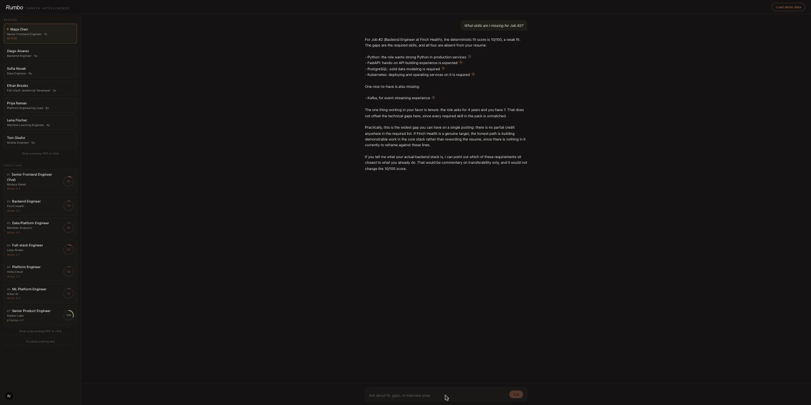
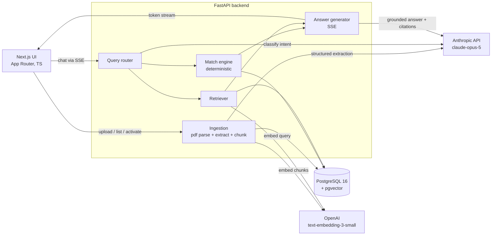

# Rumbo

Career intelligence over one resume and the roles you want. Upload a resume (PDF) and job descriptions (PDF or pasted text). Rumbo extracts both into structured data with Claude, scores every match deterministically, and answers questions in a streaming chat where every claim cites the exact line it stands on. Questions it cannot answer from your documents get a marked refusal instead of a confident guess.



## Quickstart

Requirements: Docker, an Anthropic API key, an OpenAI API key (embeddings only).

```bash
cp .env.example .env        # fill in ANTHROPIC_API_KEY and OPENAI_API_KEY
docker compose up --build
```

Open http://localhost:3000 and click **Load demo data**. The demo loads 7 synthetic resumes and 7 synthetic job descriptions with deliberate overlaps and gaps; switch the active resume in the sidebar and watch every fit score recompute. All demo people and companies are invented.

Local development (Postgres in Docker, servers on the host):

```bash
make dev-db          # pgvector on host port 5433
make dev-backend     # FastAPI with reload on :8000 (needs uv)
make dev-frontend    # Next.js on :3000
make test            # pytest (35 tests, no API keys needed)
make eval            # 13-case deterministic eval suite (calls both APIs)
```

## Why it is built this way

This is a two-document-type, cross-comparison problem, not a single corpus with Q&A on top. Pure embedding matching lies in this domain: "React" and "Vue" sit close together in embedding space but are different skills, and a fit score built on cosine similarity would give credit for the wrong framework. So the pipeline is hybrid:

1. **LLM structured extraction** (`claude-opus-5`, structured outputs): each document becomes typed JSON with verbatim evidence quotes, validated as substrings of the source text.
2. **Deterministic matching**: fit scores and gaps are plain set logic over canonical skill names. Reproducible, unit-tested, explainable; the LLM never touches the numbers.
3. **Embeddings only where they belong**: narrative questions ("how does my leadership experience align...") retrieve chunks via pgvector; skill matching never does.

<!-- TODO(bohdan): write in your own words -->
> _TODO: my reasoning for choosing this assignment option and this hybrid design._
<!-- /TODO -->

## Architecture



**Chat pipeline.** One structured-output call routes each message (intent + which jobs, with the last 10 messages for follow-up resolution). Deterministic intents (fit, gaps, comparison, interview prep) build an evidence pack from the match engine; narrative questions retrieve chunks from pgvector. Generation is instructed to cite evidence ids inline (`[E3]`); the server maps markers back to quoted sources and streams `router`, `delta`, `citations`, `refusal`, `done` SSE events. Out-of-scope questions never reach generation: the server streams a fixed refusal and a machine-checkable `refusal` event.

**Fit score.** Weighted mean of required-skill coverage (0.70), nice-to-have coverage (0.20), and experience fit (0.10); absent components redistribute their weight proportionally. Verdicts: 80+ strong, 60+ good, 40+ partial, below 40 weak. Matching is case-insensitive exact matching on canonical skill names (extraction prompts canonical naming; a small alias map is the deterministic safety net). Adjacent skills (React vs Vue) never score; the chat may mention transferability but labels it commentary.

Full architecture, data model, and API contract: [SPEC.md](SPEC.md). Implementation plan: [docs/superpowers/plans](docs/superpowers/plans).

## API

| Method and path | Purpose |
|---|---|
| `POST /api/resumes` | Upload resume PDF (parse, extract, chunk, embed) |
| `GET /api/resumes`, `POST /api/resumes/{id}/activate`, `DELETE /api/resumes/{id}` | List, switch active, delete |
| `POST /api/jobs` | Add JD (multipart PDF or `{title?, text}`) |
| `GET /api/jobs`, `GET /api/jobs/{id}`, `DELETE /api/jobs/{id}` | List and read with fit vs the active resume |
| `POST /api/chat` | SSE stream: `router`, `delta`, `citations`, `refusal`, `done`, `error` |
| `GET /api/chat/messages` | Persisted history |
| `POST /api/demo` | Wipe and reseed the demo dataset (chat history included) |
| `GET /health` | Liveness plus DB check |

## Evals

`make eval` runs 13 deterministic cases through the real pipeline against the demo dataset (reseeded per case for isolation):

- **Skill-gap correctness** (4): the reported missing-skill set exactly equals the known set for a resume/JD pair.
- **Groundedness** (3): every returned citation quote is a verbatim (whitespace-normalized) substring of its source document.
- **Refusal** (3): out-of-scope questions produce a `refusal` event and zero citations.
- **Ranking** (2): the deterministic top job matches the known best fit.
- **Router** (1): "Job #2" resolves to the right intent and job.

Assertions are structural (set equality, substring checks, event types), never string comparisons on model prose, so the suite stays stable without sampling controls. The runner retries a case only on transient API overload; assertion failures are final.

## Decisions and trade-offs

| Decision | Trade-off accepted |
|---|---|
| Claude for extraction and generation, OpenAI for embeddings, behind a one-file adapter | Two API keys and two failure modes; Anthropic has no embeddings API, and each component degrades independently |
| pgvector in the one Postgres over a dedicated vector DB | None at this scale; a separate vector store for ~100 chunks is ops without benefit |
| Deterministic matching on canonical names over embedding or LLM-judged matching | Misses fuzzy matches by design; that is the point (React must not match Vue) |
| Fit computed per request, never stored | Microseconds of recompute buys zero cache-invalidation logic |
| Pre-baked extractions in the demo seed, live embeddings | Demo does not exercise extraction (your own uploads do); evals need known extractions |
| `create_all` at startup, no migrations | Right for a single-user demo; Alembic is the production path |

<!-- TODO(bohdan): write in your own words -->
> _TODO: my reasoning on the stack choice (FastAPI + Next.js + pgvector) and the two-vendor split._
<!-- /TODO -->

## Productionization path

Single-user by design; the path to production is understood and deliberately not built here:

- **Auth and isolation**: session auth, per-user rows (`user_id` on every table), row-level scoping in every query.
- **Migrations**: Alembic instead of `create_all`.
- **Scale**: IVFFlat or HNSW index when chunks grow past tens of thousands; queue extraction (it is seconds-long) behind a worker instead of holding the upload request.
- **Resilience**: rate limiting, circuit breakers per vendor, replayable extraction jobs.
- **AWS shape**: ECS Fargate services for backend and frontend behind an ALB, RDS Postgres with pgvector, secrets in Secrets Manager, CloudWatch structured logs (the app already logs JSON).

<!-- TODO(bohdan): write in your own words -->
> _TODO: how I would take this to production, in my own words._
<!-- /TODO -->

## What I would do with more time

- Resume improvement suggestions: propose which verified experiences to surface for a target JD.
- Multi-turn interview prep with question generation grounded in responsibilities plus gap probing.
- Extraction review UI: show unverified evidence flags and let the user correct extraction before it feeds scores.
- Cross-encoder or LLM re-ranking on retrieval (measured against the eval suite first).

<!-- TODO(bohdan): write in your own words -->
> _TODO: my own priorities with more time._
<!-- /TODO -->
