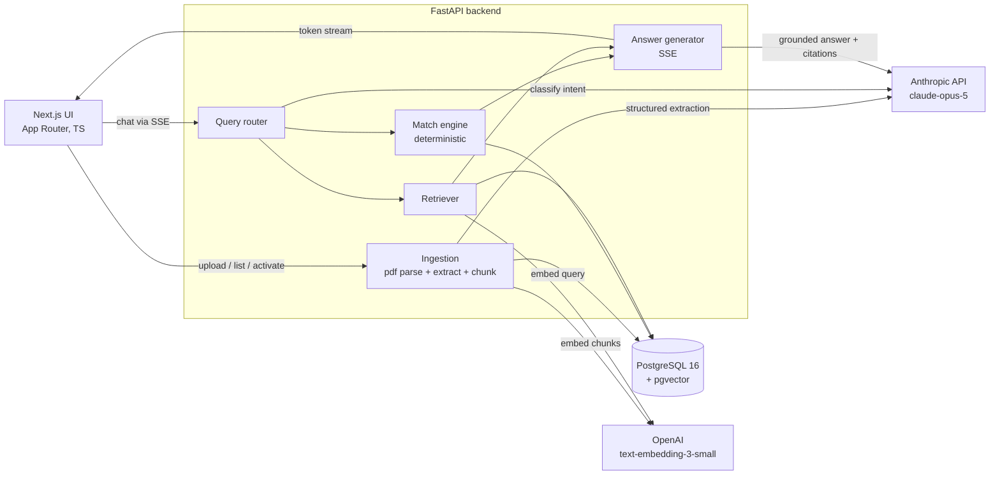

# Rumbo: Career Intelligence Assistant. Specification

Test assignment build (Option 4), timeboxed to two focused days. Guiding principle from the assignment: a solid, well-engineered basic solution beats an over-engineered complex one. Every decision below is filtered through that.

## 1. Why Option 4 shapes the architecture

This problem has two document types (one resume, many job descriptions) that must be cross-compared, not one corpus with generic Q&A on top. Pure embedding matching lies in this domain: "React" and "Vue" are semantically close vectors but different skills, and a fit score built on cosine similarity would happily give credit for the wrong framework.

So the design is hybrid:

1. **LLM structured extraction**: Claude parses each resume and JD into typed JSON (skills, experience, requirements) with verbatim evidence quotes.
2. **Deterministic skill matching**: fit scores and skill gaps are computed by plain Python set logic over canonical skill names. No model call, no similarity threshold, fully reproducible.
3. **Embeddings only for narrative questions**: "how does my leadership experience align with this role" has no set-logic answer, so those queries retrieve relevant text chunks via pgvector and generate a grounded answer.

Two hard requirements follow: every gap claim must trace to a specific JD line (citations carry verbatim quotes validated against source text), and out-of-scope questions (general career advice, anything not answerable from the uploaded documents) get a marked refusal instead of a hallucinated answer.

## 2. Product scope

**In scope**
- Upload resumes as PDF. Multiple resumes stored, exactly one active at a time (sidebar switcher). All analysis runs against the active resume.
- Add job descriptions as PDF upload or pasted text. Jobs are numbered #1, #2, ... in creation order so chat can reference "Job #2".
- Per-job fit score and verdict, visible in the sidebar, computed against the active resume.
- Chat: fit assessment, skill gaps, cross-job comparison ("which fits me best and why"), experience alignment, interview prep suggestions. Streaming responses (SSE) with citations.
- One-click demo dataset. Deterministic eval suite. Docker Compose. `/health`.

**Out of scope** (noted in README as productionization path)
- Auth and multi-user isolation, scanned-PDF OCR, JD scraping from URLs, multiple chat threads, resume editing, mobile-first layout.

## 3. Architecture



- The Next.js app proxies `/api/*` to the FastAPI backend via rewrites: single origin, no CORS setup.
- Embeddings sit behind a one-file adapter (`EmbeddingProvider` protocol with an OpenAI implementation), so swapping to Voyage or a local model touches one module.

### Vendor split (decision, with reasoning kept visible)

Anthropic has no embeddings API, so a single-vendor setup is impossible with Claude. Embeddings are a commodity component here (OpenAI `text-embedding-3-small`, 1536 dims) and are hidden behind the adapter. Claude (`claude-opus-5`) does extraction and generation: strongest structured extraction and long context, and quality matters most in exactly those two places. Best-of-breed per component behind an adapter layer. Trade-off acknowledged: two API keys and two failure modes; acceptable because each component degrades independently and the swap path is trivial.

## 4. Data model

PostgreSQL 16 with the `pgvector` extension. Schema created via SQLAlchemy `create_all` on startup (no Alembic: single-user demo, no migration history to preserve; README notes Alembic as the production path).

| Table | Columns |
|---|---|
| `resumes` | `id` uuid PK, `name` text, `source_filename` text, `raw_text` text, `extracted` jsonb, `is_active` bool, `created_at` |
| `job_descriptions` | `id` uuid PK, `seq` int (display number), `title` text, `company` text, `source` text (`pdf` or `text`), `source_filename` text nullable, `raw_text` text, `extracted` jsonb, `created_at` |
| `chunks` | `id` uuid PK, `owner_type` text (`resume` or `job`), `owner_id` uuid, `idx` int, `section` text, `content` text, `embedding` vector(1536), `created_at` |
| `chat_messages` | `id` uuid PK, `role` text, `content` text, `intent` text nullable, `citations` jsonb nullable, `created_at` |

Fit scores are **not stored**: matching is pure set logic over two jsonb blobs and runs in microseconds, so `GET /api/jobs` computes scores against the active resume on the fly. This removes cache-invalidation logic entirely (switching the active resume just changes the next response).

At this scale (tens of chunks) pgvector runs exact nearest-neighbor scans; no ANN index is created. README notes IVFFlat/HNSW as the scale path.

## 5. Extraction schemas

Extraction uses `client.messages.parse` with Pydantic models (Anthropic structured outputs), one call per document. PDFs are parsed to text locally with `pdfplumber` first; Claude receives text, not the PDF. Reason: the raw text is needed anyway for chunking and citation validation, and local parsing keeps one canonical text representation that quotes can be checked against.

**ResumeExtract**

```
full_name, headline
total_years_experience: float
seniority: junior | mid | senior | lead | principal
skills: [{name (canonical), category (language|framework|database|cloud|tool|practice),
          evidence (verbatim quote from resume), years?: float}]
roles: [{title, company, start, end, summary, technologies: [str]}]
education: [{degree, institution, year}]
```

**JDExtract**

```
title, company, location?, seniority?, min_years_experience?: float
required_skills:     [{name (canonical), evidence (verbatim JD line)}]
nice_to_have_skills: [{name (canonical), evidence (verbatim JD line)}]
responsibilities: [str]
```

**Canonicalization.** The extraction prompt instructs canonical skill naming ("PostgreSQL" not "Postgres", "React" not "React.js"). A small curated alias map (`services/aliases.py`, ~40 entries) is then applied deterministically as a safety net. Matching is case-insensitive exact match on the canonical name. Deliberately no embedding similarity and no fuzzy matching in this layer: that is the whole point of Option 4.

**Evidence validation.** After extraction, every `evidence` string is checked as a whitespace-normalized substring of `raw_text`. Failures are logged and the evidence is flagged `unverified`; unverified evidence is never cited in chat answers.

## 6. Match engine and fit score

Pure function: `match(resume_extracted, jd_extracted) -> MatchResult`. No I/O, no model calls, fully unit-tested.

```
req_cov  = |matched required| / |required|            (component absent if JD lists none)
nice_cov = |matched nice-to-have| / |nice-to-have|    (component absent if JD lists none)
exp_fit  = min(candidate_years / min_years, 1.0)      (component absent if JD sets none)

score = round(100 * weighted_mean(req_cov: 0.70, nice_cov: 0.20, exp_fit: 0.10))
```

Weights of absent components are redistributed proportionally across the present ones. Verdict bands: 80+ strong fit, 60-79 good fit, 40-59 partial fit, below 40 weak fit.

`MatchResult` carries everything the chat layer needs, each item with its JD evidence line:

```
{score, verdict,
 matched_required:  [{skill, jd_evidence, resume_evidence}],
 missing_required:  [{skill, jd_evidence}],
 matched_nice:      [...], missing_nice: [...],
 experience: {required_years?, candidate_years, fit}}
```

Adjacent skills (candidate has React, JD wants Vue) never count toward the score. The chat layer may point out transferability in prose, clearly labeled as commentary, but the number stays deterministic.

## 7. Chunking, retrieval, and the chat pipeline

**Chunking.** Section-based: resumes split on extracted section boundaries (each role, education, skills block), JDs split on paragraph groups, targeting 300-500 tokens per chunk, no overlap. These documents are 1-2 pages, so chunks stay coherent and citations map to readable units. Alternatives considered: fixed-size sliding window (rejected: splits mid-sentence, produces ugly citations), whole-document embedding (rejected: no retrieval granularity, and retrieval design is explicitly graded).

**Retrieval.** Query embedded via the adapter, cosine similarity over chunks scoped to the active resume plus the job(s) the router resolved, top 6.

**Chat pipeline** for `POST /api/chat` (SSE):

1. **Route.** One fast structured-output call to Claude classifies the message: `{intent: fit_assessment | skill_gap | comparison | interview_prep | narrative | out_of_scope, job_seqs: [int], all_jobs: bool}`. The router sees the document inventory (job numbers and titles) plus the last 10 chat messages, so "Job #2" resolves to an id and follow-ups like "what about Job #3?" inherit the intent of the preceding exchange.
2. **Build evidence pack.**
   - `fit_assessment / skill_gap / comparison`: run the match engine for the referenced job(s) (all jobs for comparison). Evidence items are the matched/missing entries with their JD lines.
   - `interview_prep`: match result plus JD responsibilities for the referenced job.
   - `narrative`: pgvector retrieval, evidence items are the top chunks.
   - `out_of_scope`: skip generation entirely. The server streams a fixed, friendly refusal and emits a `refusal` SSE event. Machine-checkable by event type, no string matching.
3. **Generate.** Every evidence item gets an id (`E1`, `E2`, ...). The generation call receives the last 10 chat messages as conversation history plus the evidence pack, and Claude streams the answer with instructions to ground every factual claim in the pack and mark citations inline as `[E3]`. The server maps markers back to `{doc, quote}` pairs.
4. **Persist.** Both messages stored with intent and citations.

**SSE protocol:** `router` (resolved intent and job refs, also consumed by the evals), `delta` (text tokens), `citations` (final array), `refusal`, `done` (message id plus eval metadata), `error`.

Model usage notes: `claude-opus-5` for both the router and generation (thinking is on by default; router runs with `effort: low` for latency, generation at the default). Sampling parameters are not accepted on this model, so eval determinism comes from structural assertions, not temperature pinning. `stop_reason: refusal` is handled with a graceful error event (career documents will not realistically trigger it, but the branch exists).

## 8. API contract

All under `/api`, JSON unless noted. Errors: `{detail: str}` with proper status codes.

| Method and path | Request | Response |
|---|---|---|
| `POST /api/resumes` | multipart PDF | `Resume` (with `extracted`), 422 on unparseable PDF |
| `GET /api/resumes` | | `[Resume]` |
| `POST /api/resumes/{id}/activate` | | `Resume` |
| `DELETE /api/resumes/{id}` | | 204 |
| `POST /api/jobs` | multipart PDF **or** `{title?, text}` | `Job` (with `extracted`, `fit` vs active resume) |
| `GET /api/jobs` | | `[Job]`, each with `fit: MatchResult` vs active resume (null if no active resume) |
| `GET /api/jobs/{id}` | | `Job` with full `MatchResult` |
| `DELETE /api/jobs/{id}` | | 204 |
| `POST /api/chat` | `{message: str}` | SSE stream (protocol above) |
| `GET /api/chat/messages` | | `[ChatMessage]` |
| `POST /api/demo` | | `{resumes: n, jobs: n}`, loads demo dataset (idempotent: wipes documents **and chat history**, then reseeds; otherwise old citations would point at deleted documents) |
| `GET /health` | | `{status: "ok", db: bool}` |

## 9. Demo dataset and seeding

- `data/demo/` holds 7 synthetic resumes and 7 synthetic JDs authored as JSON files: `{meta, raw_text, extracted}`. Personas and roles are designed with deliberate overlaps and gaps (e.g. a React-heavy frontend dev vs a JD wanting Vue; a data engineer missing Kubernetes for a platform role) so fit scores spread across all verdict bands and every gap is explainable.
- `POST /api/demo` (the "Load demo data" button) wipes all documents, chunks, and chat messages (stale citations must not outlive their source documents), inserts raw text plus the pre-baked extractions, then computes chunk embeddings live (roughly 60 short embedding calls, seconds, fraction of a cent). Extraction is the step that is pre-baked, because that is where cost and nondeterminism live, and the eval suite depends on known extractions.
- `data/demo/pdfs/` ships 3 of the same documents rendered as real PDFs (generated once by `scripts/make_demo_pdfs.py`, committed) so the live upload-and-extract pipeline can be demoed without hunting for a file.
- No real personal data anywhere; all names and companies are invented.

## 10. Evals

Small, deterministic, first-class. `evals/cases.yaml` defines 13 cases; `make eval` (wrapping `uv run python -m evals.run`) seeds the demo dataset, runs each case through the real chat pipeline, and prints a pass/fail table with a non-zero exit on failure.

| Category | Cases | Assertion (deterministic) |
|---|---|---|
| Skill-gap correctness | 4 | Answer's cited missing skills exactly match the known `missing_required` set for a known resume/JD pair from the demo data |
| Groundedness | 3 | Every citation returned in the `citations` event carries a quote that is a whitespace-normalized substring of the cited source document |
| Refusal | 3 | Out-of-scope questions ("should I ask for a raise", "what jobs are trending in 2026") produce a `refusal` SSE event and no citations |
| Best-fit ranking | 2 | For "which role fits me best", the top-ranked job equals the highest deterministic score |
| Router | 1 | "What skills am I missing for Job #2?" routes to `skill_gap` with `job_seqs=[2]` |

Assertions are structural (set equality, event types, substring checks), never exact-string comparisons on LLM prose, so they stay stable without sampling controls.

## 11. Testing, logging, health

- **pytest** on the ingestion and matching layers: alias normalization, match scoring (including absent-component weight redistribution), evidence validation, PDF text extraction against a fixture PDF, extraction response parsing with a mocked Anthropic client. Match engine and aliases are pure functions, so most tests need no DB; API-level tests run against the compose Postgres.
- **structlog** JSON logging to stdout: request ids, per-LLM-call duration and token usage, extraction validation failures.
- `GET /health` checks DB connectivity; used as the compose healthcheck.

## 12. UI design: editorial dark

Dark-mode-first, one screen, deliberately not AI-ish (no purple gradients, no Inter, no glassmorphism).

- **Palette**: warm near-black `#141110`, raised surfaces `#1C1917`, warm off-white text `#EDE8E3`, muted `#A8A29E`, terracotta accent `#C2704E` with amber `#D99A4E` for highlights. Verdict colors: muted green / amber / terracotta / muted red.
- **Type**: Fraunces (serif display, italic accents) for headings and the wordmark, Instrument Sans for body, JetBrains Mono for scores and numbers. Loaded via `next/font`.
- **Layout**: left sidebar with the document library: resume cards (active one marked, click to switch) and job cards showing a mono score, small ring gauge, and verdict word. Main area is the chat: generous line length, serif question echoes, streaming answers, citation chips that expand to show the quoted source line and which document it came from. Top bar: Rumbo wordmark, "Load demo data" button.
- **Empty state**: two drop zones (resume PDF, JD PDF-or-paste) with a one-line explanation of what the app does, plus the demo button front and center.
- Micro-interactions: score rings animate on load, citation chips expand smoothly, streaming cursor. No em dashes anywhere in UI copy.

## 13. Repository layout

```
rumbo/
  docker-compose.yml           # db (pgvector/pgvector:pg16), backend, frontend
  Makefile                     # make dev / test / eval / seed
  SPEC.md  README.md  .env.example
  backend/
    pyproject.toml             # uv-managed
    app/
      main.py config.py db.py models.py schemas.py
      routers/   resumes.py jobs.py chat.py demo.py health.py
      services/  pdf.py extraction.py aliases.py matching.py
                 embeddings.py chunking.py retrieval.py chat_pipeline.py
    tests/
    evals/       cases.yaml run.py
    data/demo/   *.json  pdfs/*.pdf
    scripts/     make_demo_pdfs.py
  frontend/
    package.json next.config.ts
    app/         (App Router, single page + layout)
    components/  sidebar/ chat/ upload/
    lib/         api.ts sse.ts types.ts
```

## 14. Decisions log

| Decision | Alternatives considered | Why |
|---|---|---|
| FastAPI backend over single Node backend | Next.js API routes only; Express | LLM tooling lives in Python: Pydantic structured outputs, pytest, eval harness ergonomics. Frontend stays thin. |
| pgvector over dedicated vector DB | Pinecone, Chroma, Qdrant | One database for relational and vector data, zero extra ops. A separate vector DB at ~100 chunks is over-engineering. |
| Next.js over plain API + static page | Vite SPA | SSE-friendly streaming UI and a polished interface, which is explicitly graded; App Router is the current default. |
| Claude for extraction and generation, OpenAI for embeddings | Single-vendor OpenAI; Voyage embeddings | Anthropic has no embeddings API, so single-vendor Claude is impossible. Embeddings are commodity and sit behind a one-file adapter; Claude is strongest where quality matters (extraction, grounded generation). Cost: two keys, two failure modes; accepted. |
| `claude-opus-5` for both extraction and chat | Sonnet 5; Haiku for extraction | Best extraction and answer quality; at demo scale cost is negligible. One model, simpler config. |
| Deterministic matching on canonical skill names | Embedding-similarity skill matching; LLM-judged fit | Embedding similarity gives credit for React vs Vue. LLM judging is non-reproducible and unexplainable. Set logic is testable and every gap traces to a JD line. |
| Section-based chunking, ~300-500 tokens, no overlap | Sliding window; whole-doc embedding | Documents are short; sections are coherent citation units. Overlap adds noise at this scale. |
| Fit scores computed on request, not stored | `fit_scores` table | Microsecond pure function; storing adds invalidation logic (resume switch, re-upload) for zero gain. |
| Local PDF-to-text (`pdfplumber`), Claude gets text | Send PDF bytes to Claude | Raw text is needed anyway for chunking and evidence substring validation; one canonical text representation. |
| Pre-baked extractions in demo seed, live embeddings | Full pipeline on seed; pre-baked vectors | Extraction is where cost and nondeterminism live and evals depend on known extractions. Embeddings are cheap, fast, and evals never compare vectors. |
| `create_all` on startup, no Alembic | Alembic migrations | Single-user demo, disposable schema. Alembic is listed in the productionization path. |
| Refusal as SSE event type, fixed server-side text | Prompted refusal with marker string | Machine-checkable without string matching; the model cannot forget the marker. |
| Structural eval assertions | LLM-as-judge; exact-output comparison | Judge is nondeterministic and costs tokens; exact strings break on any model update. Set equality and substring checks are stable and free to check. |

## 15. Build plan (vertical slices)

| Slice | Contents | Verify |
|---|---|---|
| 0. Scaffold | compose, DB, FastAPI skeleton, Next.js skeleton, `/health`, `make dev` | `docker compose up` serves UI and healthy API |
| 1. Ingestion | PDF parse, extraction, aliases, chunking, embeddings, resume/job CRUD, sidebar cards, demo seed | pytest green; demo button populates sidebar; upload a sample PDF end to end |
| 2. Matching | match engine, fit on `GET /api/jobs`, score rings and verdicts in sidebar | matching unit tests green; demo dataset shows spread of scores |
| 3. Chat | router, evidence packs, SSE generation, citations UI, refusal path, history | manual: each intent answers with citations; refusal fires on out-of-scope |
| 4. Evals + polish | eval runner and 13 cases, README (with marked TODO blocks left for your own words), UI polish, empty states, final pass | `make eval` passes; `make test` passes; fresh-clone `docker compose up` works |

Day 1 targets slices 0-2; day 2 targets slices 3-4.

## 16. Environment

`.env` (see `.env.example`): `ANTHROPIC_API_KEY`, `OPENAI_API_KEY`, `DATABASE_URL`. The README documents setup in three commands: copy env file, `docker compose up`, click "Load demo data".

`backend/pyproject.toml` pins `anthropic>=0.116.0` (a release line with `client.messages.parse` and current model support), so a fresh clone cannot resolve an older SDK that lacks structured outputs.
